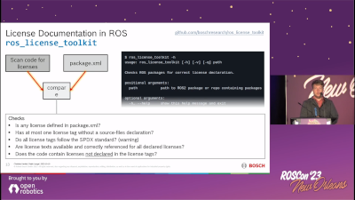

# ros_license_toolkit

[](https://github.com/boschresearch/ros_license_toolkit/actions/workflows/pytest.yml)
[](https://github.com/boschresearch/ros_license_toolkit/actions/workflows/lint.yml)
[](https://github.com/boschresearch/ros_license_toolkit/issues)
[](https://github.com/boschresearch/ros_license_toolkit/pulls)
[](https://pypi.org/project/ros-license-toolkit/)
[](https://github.com/boschresearch/ros_license_toolkit/search?l=python)
[](https://github.com/boschresearch/ros_license_toolkit/blob/main/LICENSE)

> **Warning**
> For any legal questions, please consult a lawyer. This tool is not a substitute for legal advice.

## Motivation

ROS packages must have licenses. This tool checks if the license declarations in the `package.xml` matches the license(s) of the code. We do this by using `scancode-toolkit` to scan the code and compare the results to the declaration in the `package.xml`

## Presentation

[](https://vimeo.com/879001224/d6461b638a)

## Functionality


## Features

This checks:

- [x] Is `package.xml` conform to it's schema?
    [- SchemaCheck](src/ros_license_toolkit/license_checks/schema_check.py#L27)
- [x] Is any license defined in `package.xml`?
    [- LicenseTagExistsCheck](src/ros_license_toolkit/license_checks/license_tag_exists_check.py#L24)
- [x] Has at most one license tag without a source-files declaration?
    [- LicenseTagExistsCheck](src/ros_license_toolkit/license_checks/license_tag_exists_check.py#L24)
- [x] Do all licenses tags follow the SPDX standard?
    [- LicenseTagIsInSpdxListCheck](src/ros_license_toolkit/license_checks/license_tag_is_spdx.py#L24)
- [x] Are license texts available and correctly referenced for all declared licenses?
    [- LicenseTextExistsCheck](src/ros_license_toolkit/license_checks/license_text_exists_check.py#L30)
- [x] Does the code contain licenses not declared in any license tags source-file attribute (source-files="src/something/**")?
    [- LicensesInCodeCheck](src/ros_license_toolkit/license_checks/license_in_code_check.py#L28)

## Usage

### Installation

Install the package from source:

```bash
pip install .
```

### Basic Usage

You should then have the executable in your `$PATH` and can run it on any ROS package or a directory containing multiple ROS packages:

```bash
ros_license_toolkit my_ros_package
```

### All Options

```bash
$ ros_license_toolkit -h
usage: ros_license_toolkit [-h] [-c] [-v] [-q] [-e] [-w] path

Checks ROS packages for correct license declaration.

positional arguments:
  path                  path to ROS2 package or repo containing packages

options:
  -h, --help            show this help message and exit
  -c, --generate_copyright_file
                        generate a copyright file
  -v, --verbose         enable verbose output
  -q, --quiet           disable most output
  -e, --continue_on_error
                        treats all errors as warnings, i.e. will give
                        returncode 0 even on errors
  -w, --warnings_as_error
                        treats all warnings as errors
```

Additionally, there is an option to ignore single files, folders and types of files.
If there exists a `.scanignore` in the **top level directory** of a package,
everything in it is going to be ignored.
The file entries work similar to a `.gitignore` file, including making comments with `#`.
One Example for a custom `.scanignore` file:

```
.git/* # folder
README.txt # file
README.* # file pattern
```

Per default, ros_license_toolkit ignores the following:

```
.scanignore
package.xml
setup.py
setup.cfg
CMakeLists.txt
.git/*
```

### Using it as a GitHub action

You can use `ros_license_toolkit` inside your GitHub workflow in order to check licenses in your
repository in each pull request. Use the following job inside your workflow file:

```yaml
jobs:
  check_licenses:
    runs-on: ubuntu-latest

    steps:
      - uses: actions/checkout@v3
      - uses: boschresearch/ros_license_toolkit@1.2.3
```

## State of Development

*WORK IN PROGRESS*
This is currently working and feature complete to the point it was originally intended.
But there are still open points concerning testing and it is also very important to make sure how this behaves with existing ROS packages.
In particular, the following things will have to be done:

### To Do

- [x] Coverage analysis
- [x] Linter(s) per CI
- [x] Field trials (check existing ROS packages and see what to do with the results). see [field-trials/](field-trials/)
- [x] Allow license name in tag to be also full name of SPDX key.
- [x] Each LicenseTag should have SPDX id.
- [x] Single license tag without file attribute and single license text should match automatically.
- [x] Turn into github action.
- [x] Evaluate runtime. If scancode-toolkit takes too long on too many cases, we will have to look for an alternative.
- [x] Error of `LicenseTagIsInSpdxListCheck` must be a warning
- [ ] Idea: Create pull requests for package maintainers automatically.

## License

ros_license_toolkit is open-sourced under the Apache-2.0 license. See the
[LICENSE](LICENSE) file for details.
